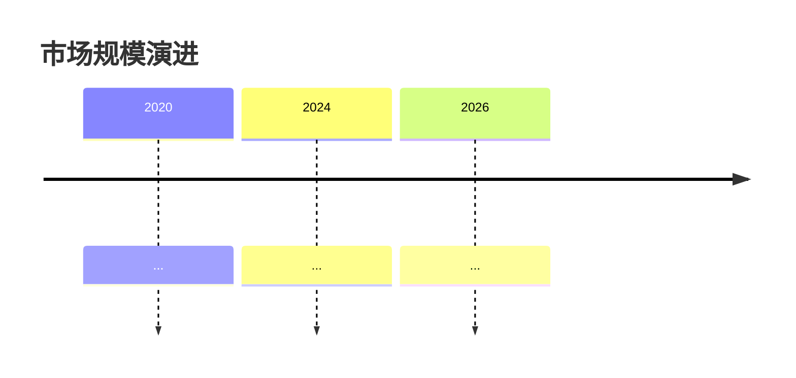
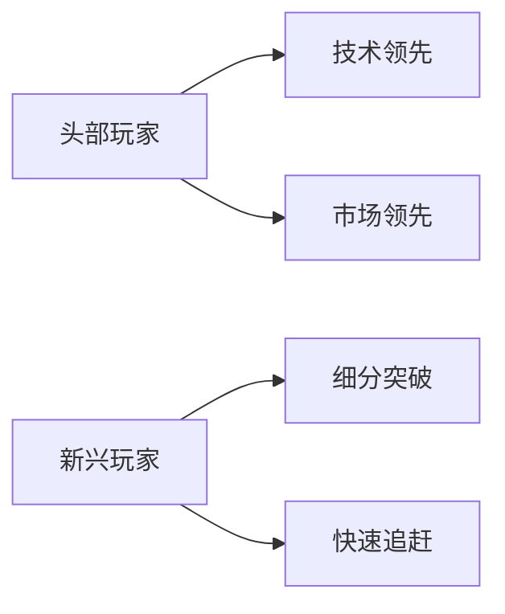

# 最终报告模板(供 optimizer Phase 3 参考)

## 报告封面

```markdown
# {主题}研究报告

| 项目 | 信息 |
|---|---|
| 报告版本 | v3.1.0-cc |
| 生成日期 | {YYYY-MM-DD} |
| 研究模式 | {minimal/enhanced/extreme} |
| 总字数 | {N} |
| Mermaid 图表 | {N} 个({K} 种类型) |
| Markdown 表格 | {N} 个 |
| 子 Agent 数 | {N} |

> 本报告由 Claude Code research skill 生成,采用多 Agent 协作 + 三阶段统稿流程。所有数据均标注来源,标注 ⚠️ 的内容为搜索失败时的知识库补充,建议人工核实。
```

---

## 报告正文结构

### 执行摘要

```markdown
## 执行摘要

### 章节导语
(100-200 字,本报告的研究背景、核心问题、阅读价值)

---

### 核心结论
(段落叙述 200-300 字,提炼 3 个核心论点)

**图表 1:行业全景图**
```mermaid
mindmap
  root(({主题}))
    分支1
    分支2
    分支3
```
**图表解读**:{提炼洞察，禁止简单重复图表内容}

### 关键数据

**表格 1:核心指标速览**
| 指标 | 当前值 | 同比 | 数据来源 |
|---|---|---|---|

**表格解读**:{提炼洞察，禁止简单重复表格内容}

### 本章节小结
(150-250 字,概括全报告核心,引出第二章)
```

### 第一部分:行业现状

```markdown
## 第一部分:行业现状

### 章节导语
(100-200 字)

---

### 1.1 市场规模与增长

(段落 150-300 字)

**图表 2:市场规模演进**

**图表解读**:80-150 字

(段落 150-300 字)

**表格 2:细分市场规模**
| 细分 | 2024 | 2025E | 2026E | CAGR |
|---|---|---|---|---|

**表格解读**:{提炼洞察，禁止简单重复表格内容}

### 1.2 竞争格局

(段落 150-300 字)

**图表 3:竞争格局关系图**

**图表解读**:80-150 字。{数据含义} + {趋势洞察} + {实操启示}

**表格 3:主要玩家对比**
| 玩家 | 技术能力 | 市场规模 | 阶段 | 核心优势 |
|---|---|---|---|---|
| ... | ... | ... | ... | ... |

**表格解读**:{数据含义 + 趋势洞察 + 实操启示}

### 本章节小结
(150-250 字)
```

### 第二部分:技术与创新 / 第三部分:政策与监管 / ... / 结论与建议

(每部分都遵循:导语 → 子主题(段落 + 图表/表格 + 解读)→ 本章节小结 模式)

---

## 附录

### 附录 A:信息来源汇总

| 来源类型 | 数量 | 主要来源 |
|---|---|---|
| 政府/监管机构 | n | 发改委、能源局、工信部 |
| 行业协会 | n | CNESA、储能联盟 |
| 上市公司公告 | n | 上交所、深交所、港交所 |
| 行业研究 | n | 艾瑞、易观、IDC、Gartner |
| 学术资源 | n | 知网、Google Scholar |
| 财经媒体 | n | 财新、第一财经 |
| 知识社区 | n | 知乎 |
| 开源社区 | n | GitHub |

### 附录 B:置信度分级

| 评级 | 定义 |
|---|---|
| high | 多个独立权威来源验证 |
| medium | 单一权威来源 / 多个二级来源 |
| low | 推断 / 预测 |
| ⚠️ 待验证 | 知识库补充,搜索失败 |

### 附录 C:子 Agent 贡献

| Agent | 角色 | 字数 | 来源数 | 图表数 | 置信度 |
|---|---|---|---|---|---|

### 附录 D:执行统计

| 指标 | 数值 |
|---|---|
| 总耗时 | {duration} |
| 子 Agent 数 | {N} |
| 搜索总数 | {N} |
| 成功抓取 | {N} |
| 知识库补充比例 | {p}% |
| 评审总分 | {X}/100 |
