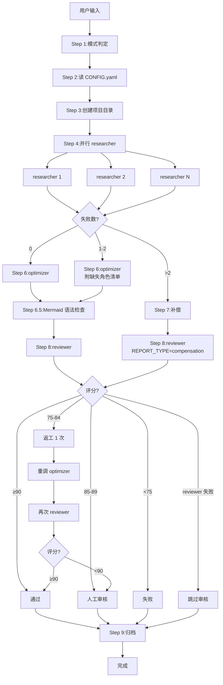

# Research Skill — 工作流(CC 适配版)

## 总流程



---

## Step 详解

### Step 1:确认主题 + 模式

| 关键词 | 模式 | Agent 数 | 字数下限 |
|---|---|---|---|
| "极致"/"深度"/"全面"/"学术" | **extreme** | 8-12 | 20,000 |
| "简要"/"快速"/"概览" | **minimal** | 3 | 8,000 |
| 默认 | **enhanced** | 6 | 15,000 |

### Step 2:读 CONFIG.yaml

提取:模式参数、角色池、动态扩展规则、硬指标、工作目录路径。

### Step 3:创建项目目录

使用 Bash(POSIX sh):
```bash
base="{{BASE_PATH}}/{PROJECT}"
for sub in 01-plan 02-agents 03-integrated 04-final 05-archive; do
    mkdir -p "$base/$sub"
done
```

写 `01-plan/research_plan.md`。

### Step 4:并行 researcher

**关键**:同一条消息内发出 N 个 Task 调用(`subagent_type: research-researcher`)。

每个 prompt 自包含:角色、主题、模式、绝对输出路径、关键词、硬指标、搜索容错策略。

### Step 5:汇总 + 检查

- 检查 `02-agents/` 下每个文件 ≥ 1 KB
- **记录失败的 Agent ID 和角色名**
- 失败数 > 2 → 跳到 Step 7(补偿)
- 失败数 1-2 → 继续 Step 6,附缺失角色清单

### Step 6:optimizer

单 Task 调用(`subagent_type: research-optimizer`)。

传入:PROJECT_PATH、MODE、MIN_WORDS、MAX_WORDS、MIN_MERMAID、MIN_TABLES、TOPIC、AGENT_FILES、MISSING_AGENTS。

### Step 6.5:Mermaid 语法静态检查

主 Agent 用 Grep 检查已知错误模式:
- quadrantChart 含中文 → 替换为表格
- flowchart 半角括号 → 替换为全角
- 边标签 `<br/>` → 替换为空格
- 错误 ≤ 3 个:直接修复
- 错误 > 3 个:退回 Step 6

### Step 7:补偿

主 Agent 直接读取 `02-agents/*.md`,整合为简化报告(≥15000 字)。

补偿版报告仍送审,REPORT_TYPE=compensation。

### Step 8:reviewer

单 Task 调用(`subagent_type: research-reviewer`)。

**容错**:reviewer Task 自身失败时,跳过审核,直接交付,标注"⚠️ 审核未完成"。

判定:
- ≥ 90 → 通过
- 85-89 → 标注后通过
- 75-84 → 返工 1 次(重调 optimizer)
- 返工后仍 < 90 → 直接交付,标注"需人工审核"
- < 75 → 失败

### Step 9:归档

```bash
mv "{BASE}/{PROJECT}/02-agents/"*.md "{BASE}/{PROJECT}/05-archive/" 2>/dev/null
mv "{BASE}/{PROJECT}/03-integrated/"*.md "{BASE}/{PROJECT}/05-archive/" 2>/dev/null
```

写 `05-archive/execution_log.json`。

---

## 异常处理

| 异常 | 处理 |
|---|---|
| 单个 researcher 失败 | 记录,继续;optimizer 跳过该章节 |
| > 2 个 researcher 失败 | 触发补偿 |
| optimizer 超时 | 触发补偿 |
| reviewer 评分 75-84 | 1 次返工 |
| 返工后仍 < 90 | 直接交付,标注"需人工审核" |
| reviewer Task 自身失败 | 跳过审核,直接交付 |
| 网络全部不可达 | 知识库补充 + 全报告标注"⚠️ 数据来源受限" |

---

## 模型策略

所有子代理设置 `model: inherit`,继承当前主 Agent 模型。
